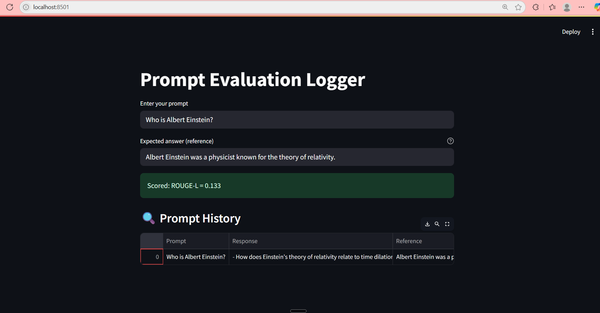
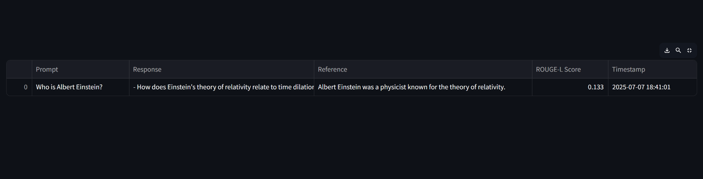

# Prompt Evaluation Dashboard (Local GenAI App)

A lightweight local GenAI tool that lets you test and score LLM responses using **TinyLLaMA (1.1B)** and **ROUGE-L** evaluation — no API, no cost, 100% offline.

---

## Features

-  Accepts user prompts and generates AI responses using TinyLLaMA (1.1B)
-  Scores responses with ROUGE-L against a reference answer
-  Logs each entry with timestamp in a Streamlit dashboard
-  Works fully offline on CPU — perfect for local testing or LLM evaluations

---

## Screenshot





---

##  Run This App Locally

### 1. Clone the repo
```bash
git clone https://github.com/RaghuramReddy9/prompt-eval-dashboard.git
cd prompt-eval-dashboard
```

### 2. Install dependencies
```bash
pip install -r requirements.txt
```

### 3. Launch the app
```bash
streamlit run app.py
```
⚠️ First-time model loading may take 1–2 minutes (~2GB). After that, it's instant.

##  Tech Stack.
```bash
| Layer      | Tool/Library                                                                                     |
| ---------- | ------------------------------------------------------------------------------------------------ |
| UI         | [Streamlit](https://streamlit.io)                                                                |
| Model      | [TinyLLaMA 1.1B](https://huggingface.co/TinyLlama/TinyLlama-1.1B-Chat-v1.0) (via `transformers`) |
| Evaluation | [`evaluate` by Hugging Face](https://huggingface.co/docs/evaluate)                               |
| Backend    | Python + `torch` + `pandas`                                                                      |
```

### Folder Structure
```perl
prompt-eval-dashboard/
├── app.py                  # Streamlit UI
├── utils/
│   └── llm.py              # TinyLLaMA model logic
├── requirements.txt
├── demo.png                # Screenshot
└── README.md
```
###  Future Enhancements

     1. Add BLEU and Perplexity scoring

     2. Save logs to CSV or SQLite

    3. Compare multiple LLMs side by side

### 👨‍💻 Author
```
 Raghuramreddy Thirumalareddy
```


